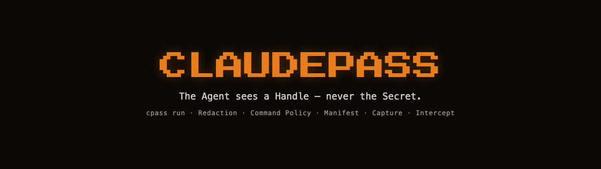

<p align="center"></p>


A secret manager for AI coding agents. Free and open source under the
[MIT license](LICENSE).

## The problem

Developers working with AI coding agents constantly need the agent to run commands that require secrets — deploy scripts, API calls, database migrations, cloud CLIs — and today the only way to hand one over is to paste it into the conversation or point the agent at a `.env` file it can read. Either way the value enters the Agent's Context: it is sent to the model provider, written into transcripts and session logs, and can be echoed back in any tool result. ClaudePass lets an Agent use a Secret at the moment a command runs — injected by a local Broker into that one child process — without the value ever entering the Agent's Context at all.

## Install

`gumruyanzh/claudepass` is a public repository on GitHub, open source
under the [MIT license](LICENSE) (see
[ADR-0011](docs/adr/0011-free-and-open-source.md)). Built binaries are
also published at [claudepass.com](https://claudepass.com), so installing
needs no GitHub credentials either way.

**curl:**

```bash
curl -fsSL https://claudepass.com/install.sh | sh
```

**Homebrew** (from the owner's tap):

```bash
brew install softorize/tap/cpass
```

Both installers download a GoReleaser-built archive and its `checksums.txt`
straight from claudepass.com (see [`deploy/`](deploy/) for how release
binaries reach the site) and verify sha256 before installing. The release
pipeline that produces them is `.goreleaser.yaml` and
`.github/workflows/release.yml` at the repo root — see CLA-16.

## 60-second quickstart

Everything below is one continuous session in a project directory: an empty
Vault, one Secret, a Manifest declaring it, the Claude Code integration, and
a command that uses the Secret without ever printing it.

<!-- quickstart:begin -->
```bash
# 1. Create a Vault. CPASS_KEY (CI) or the platform's unlock source (macOS
#    Keychain, or a passphrase on Linux) supplies the encryption key — see
#    docs/SECURITY.md for exactly where that key lives.
cpass init

# 2. Store a Secret under a Handle. The value is typed at a hidden prompt —
#    cpass add refuses without a terminal, so an Agent can never pipe a
#    value it already knows straight into the Vault.
cpass add stripe/live

# 3. Declare the Handles this project needs. No values live in this file;
#    it's meant to be committed.
cpass manifest init
cpass manifest add stripe/live

# 4. Wire up Claude Code: an Intercept hook, a Command Policy hook, and a
#    skill teaching an Agent to use cpass. Idempotent — safe to re-run.
cpass integrate claude

# 5. Run the real command. cpass run reads the Manifest, injects stripe/live
#    as $STRIPE_LIVE into this one child process, and nothing else — swap
#    the sh -c '...' below for your actual deploy/curl/psql/gcloud command;
#    the Secret reaches it the same way, by reading its own environment.
cpass run -- sh -c '[ -n "$STRIPE_LIVE" ] && echo "deploy: authenticated"'
```
<!-- quickstart:end -->

A real session looks like this:

```
$ cpass init
initialised vault at /Users/you/Library/Application Support/claudepass/vault.cpv

$ cpass add stripe/live
value for stripe/live: ************************
stored stripe/live (env STRIPE_LIVE)

$ cpass manifest init
created .claudepass.toml

$ cpass manifest add stripe/live
declared stripe/live in .claudepass.toml

$ cpass integrate claude
installed the ClaudePass plugin at /Users/you/.claude/skills/claudepass
registered hook: UserPromptSubmit -> cpass intercept
registered hook: PreToolUse (Bash) -> cpass policy --hook
registered skill: claudepass
it loads as claudepass@skills-dir on the next `claude` session (or run /reload-plugins in one already open)

$ cpass run -- sh -c '[ -n "$STRIPE_LIVE" ] && echo "deploy: authenticated"'
deploy: authenticated
```

The value of `stripe/live` was never typed into a command line, never
appeared in this terminal's scrollback, and — because Claude Code's plugin
is now installed — never gets past a paste into the Agent's prompt either.
This exact sequence runs against a freshly built binary as part of this
repo's own test suite (`internal/e2e/docs_test.go`), so it can't drift out
of date with the CLI it documents.

## Handles, the Manifest, Capture, and Intercept

A Secret lives in your Vault under a Handle — an opaque name like
`stripe/live`. That Handle, never the value, is the only form in which a
Secret is ever visible to an Agent. A Handle carries a default Binding (an
environment variable name, or a temp file) that says how the value should
land in a command's process; a project's Manifest (`.claudepass.toml`, safe
to commit — it contains no values) declares which Handles the project needs,
so an Agent runs `cpass run -- <command>` once and gets everything the
project was told about, with no guessing and no `.env` file for it to read.

When a command produces a brand-new value instead of consuming one — a
migration prints a generated token, a CLI mints a key — `cpass capture
<handle> -- <command>` stores its stdout straight into the Vault as a new
Secret and prints only the Handle back, so a value born in a tool's output
never reaches the Agent's Context either.

And when a human pastes a real value into the conversation by mistake,
Claude Code's `UserPromptSubmit` hook runs `cpass intercept`: it moves the
value into the Vault before the model ever sees the prompt and tells the
human which Handle to resubmit with instead. If it does go through anyway
(prefixed with `!!`, for a false positive), the Secret is stored flagged
Exposed, so `cpass exposed` and a one-line reminder on every later `cpass
run` keep nagging until it's rotated.

The Broker is the one place that ever holds a Secret's raw value: it
resolves a Handle at the moment `cpass run` spawns your command and injects
it into that one child process, nowhere else. Everything the command writes
to stdout and stderr passes through Redaction on the way back, which
replaces the value — and its base64, hex, percent- and JSON-escaped forms —
with `[REDACTED:<handle>]` before an Agent can read it; this is honest
best-effort, not a guarantee, and `docs/SECURITY.md` says exactly what it
does and doesn't catch. Command Policy refuses, before the command even
starts, anything whose only real purpose is to reveal a Secret rather than
use it: `env`, `printenv`, reading a `.env` file, and the like.

## Documentation

- [`CONTEXT.md`](CONTEXT.md) — the vocabulary this repo and this README use throughout (Secret, Handle, Agent, Broker, Context, Redaction, Command Policy, Vault, Binding, Manifest, Capture, Intercept, Exposed).
- [`docs/PRD.md`](docs/PRD.md) — the product spec.
- [`docs/adr/`](docs/adr/) — the design decisions and why alternatives were rejected.
- [`docs/SECURITY.md`](docs/SECURITY.md) — exactly what the Vault, the Broker, both hooks, `cpass run`, and Redaction do and touch, every `CPASS_*` environment variable, and the no-telemetry guarantee.
- [`docs/THREATS.md`](docs/THREATS.md) — the threat model, what's deliberately out of scope, and the leak paths that honestly remain.
- [`LICENSE`](LICENSE) — MIT.
- [`CONTRIBUTING.md`](CONTRIBUTING.md) — how to build, test, and contribute.

## Build from source

```bash
go build -o cpass ./cmd/cpass
go test -race -count=1 ./...
```
